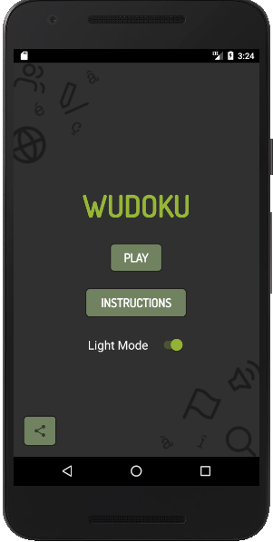
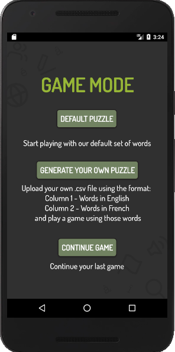
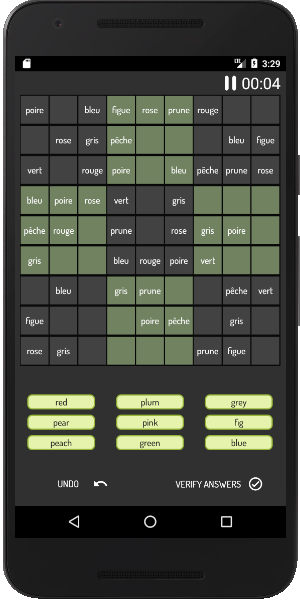

# Word-Sudoku

Word Sudoku is a language-learning Android application that teaches users French through the game of Sudoku.

Developed with:
- Java
- XML

## Features

- Toggle between English->French or French->English modes
- Users can upload their own set of vocabulary words
- Ability to continue the user's last game
- Listening Comprehension Mode
    - When users tap on a Sudoku cell that contains a word in French/English, the word is "spoken" using Android's   TextToSpeech method
- Choose from the following puzzle dimensions:
    - 4x4
    - 6x6
    - 9x9
    - 12x12
- Users can verify their answers while or after completing a puzzle
- Timer that begins as the user opens up a new puzzle, and pauses if the user leaves the app
    - Can also be paused on demand by user
- Light and dark modes, for day- and night-time play

### Images of Word Sudoku Android Application

#### Landing Page

#### Game Modes Page

#### Game Play - Sudoku Board

